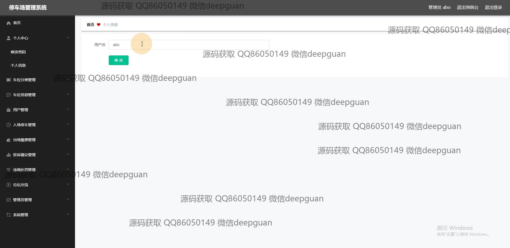
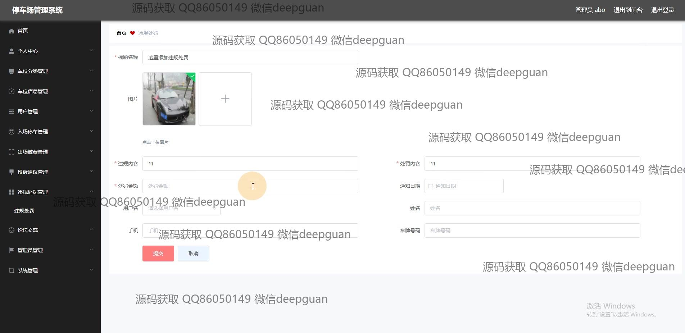
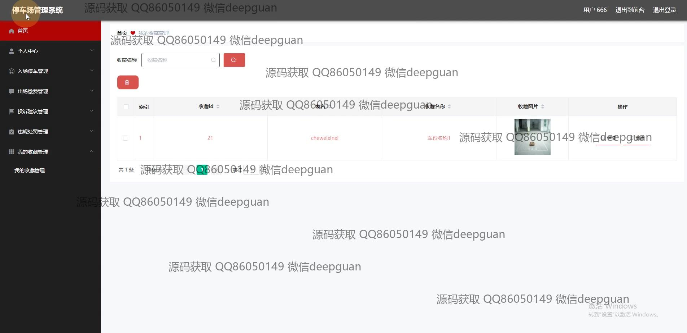

<h1 align="center">的停车场管理系统vue</h1>

## 简介
停车场管理系统：功能模块包括用户管理、车位分类管理、车辆信息管理、出入场管理、投诉建议和论坛交流，支持实时在线交流，提高停车场运营效率和用户体验。    --计算机毕业设计源码；毕设源码；java毕业设计源码

## 联系方式

<h3 align="center">获取完整代码与数据库文件 + 微信：deepguan QQ: 86050149 QQ群: 783742310</h3>

<h3 align="center">可帮忙远程部署 包运行成功！提供远程部署、修改代码、设计文档指导、代码讲解等服务！</h3>

## 功能介绍（完整见运行截图）
管理员：基本功能包括登录、注册、退出和网站首页的访问，能够管理和审核车辆入场与出场记录。提供车辆、车位信息管理、用户管理、投诉建议管理、违规处理管理、系统公告发布和后台管理功能。通过在线交流模块与用户沟通解决问题，并查看和回应论坛帖子。支持查看系统日志和网站备案以维护系统安全与合规性。

用户：基本功能包括登录、注册、退出，以及通过首页导航栏访问车位信息、论坛交流、个人中心等模块。可进行车位查询与收藏、车辆入场与出场管理。能够提交投诉建议，并查看个人信息、修改密码、管理车牌信息与头像。使用论坛交流模块进行交流，查看系统公告，参与社区互动。可筛选和分类车位信息，使用搜索功能提高管理效率，同时享有使用车位评论与收藏的能力。

## 运行截图

本代码来源于网络,仅供学习参考使用!

